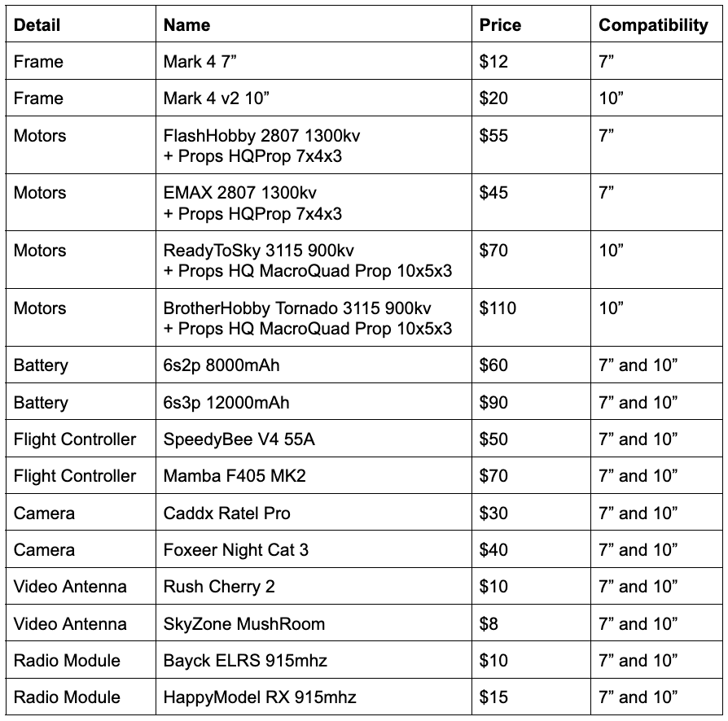

# Task for DEV Challenge XXI final

## Description

Create a visual FPV drone builder with a categorized panel of parts (e.g., Power Components, Propellers) and a working area for assembling them. Parts are dragged and connected at specific points (connectors), with visual indicators for compatibility.

## Drone assembling requirements

There are two types of drones to build: 7” and 10”. The frame size determines the drone type. 

### The main parts each drone consists of:
- Frame - 1 piece
- Motor + Propeller - 4 pieces
- Battery - 1 piece
- Flight controller - 1 piece
- Camera - 1 piece
- Video antenna - 1 piece
- Radio module - 1 piece

### Shared parts (can be used on both 7” and 10” drones):
- Battery
- Flight controller
- Camera
- Video antenna
- Radio module

### Exclusive parts (can be used only on [ONE] type of drone (either 7” or 10”)):
- Frame
- Motor + Propeller

## Main Requirements

### Interface

The UI is divided into two parts: a parts panel and a working area (top view) for drone assembly.
Assets of the drone's components can be found [here](images/drone_asset.zip).

### Assembly and Connection

- Dragging parts from the panel to the working area.
- Slots on the frame determine possible locations for parts, ensuring proper compatibility.
- The user will receive visual feedback, such as highlights or guides when parts are compatible.
- If a part is incompatible, an error message will be displayed or the connection will be prevented.

### Completeness verification
The drone is 'complete' when all needed parts are placed on the frame. 
- All 4 Motors should be of 1 type per drone. For example, when “Motor X” is added to the drone, it’s impossible to add “Motor Y” even if they both fit the frame.
- The frame, which determines the drone type, should be added first to the assembling area. Frame compatibility should validate other details.
- Each part can be added at most X pieces (4 for motors, 1 for others). Should [NOT] be possible to add more details of the same type. For example, when “Camera” is added to the drone, the other detail of type “Camera” should not be possible to attach

### Drone Cost Calculation
Display the total cost of the drone with automatic updates.

### Assembly Editing
Button to clear the working area.

### Configuration Export
Export configuration in JSON or CSV format, including fields such as part names, quantities, positions, and compatibility details.

## Evaluation Criteria

1. The use of ready-made libraries, CSS/JS frameworks is prohibited, only pure HTML/CSS/JS. TypeScript is not allowed.
2. Cross-browser is not a criterion. Entries will be checked in the latest version of Google Chrome.

Technical assessment
1. Drag-drop functionality — 100 points.
2. Visual indication of compatibility — 100 points.
3. Indication of connection points on the assembly area — 100 points.
4. Completeness verification (visual indication of completed status) — 50 points.
5. Cost calculation (price is recalculated as soon as detail is placed) — 50 points.
6. Clear all button — 30 points.
7. Export to JSON or CSV  — 82 points.
